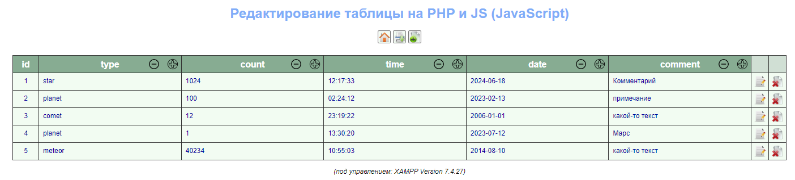
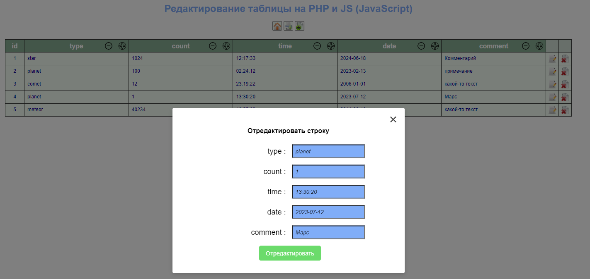

# practPHP
Простой пример, как редактировать таблицу в MySQL на PHP (+ загружать файлы на сайт)

Главное окно с таблицей:

Окно редактирования и добавления файлов:

Данные редактируются в этом примере независмо от количества столбцов. Можно добавлять, удалять столбцы в таблице из СУБД MySQL, что является главным отличием от проекта [practUpdate](https://github.com/alex1543/practUpdate). Исходники гарантированно работают под XAMPP Version 7.4.27. Для создания готовой структуры базы данных (БД) необходимо выполнить скрипт test.sql из каталога с исходниками. Иначе, структура БД будет создана сама из PHP.
